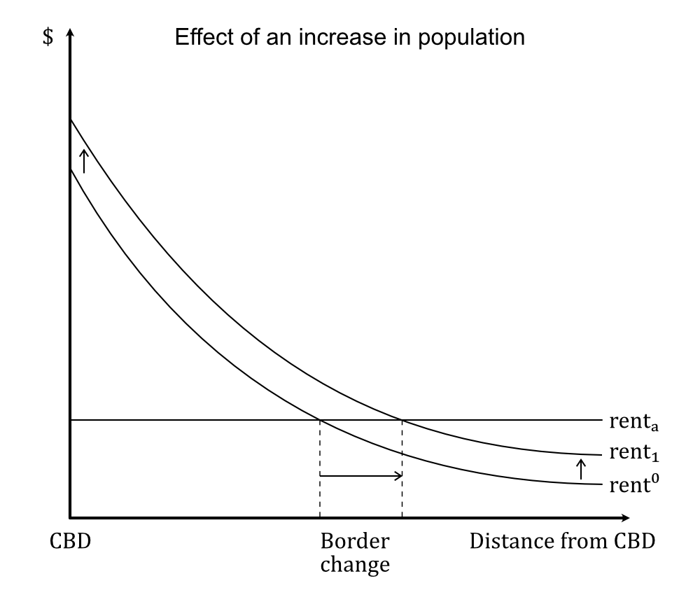
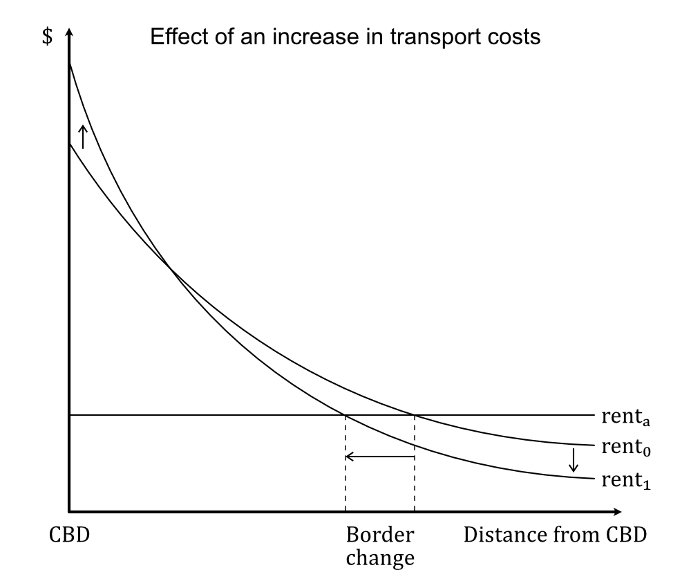
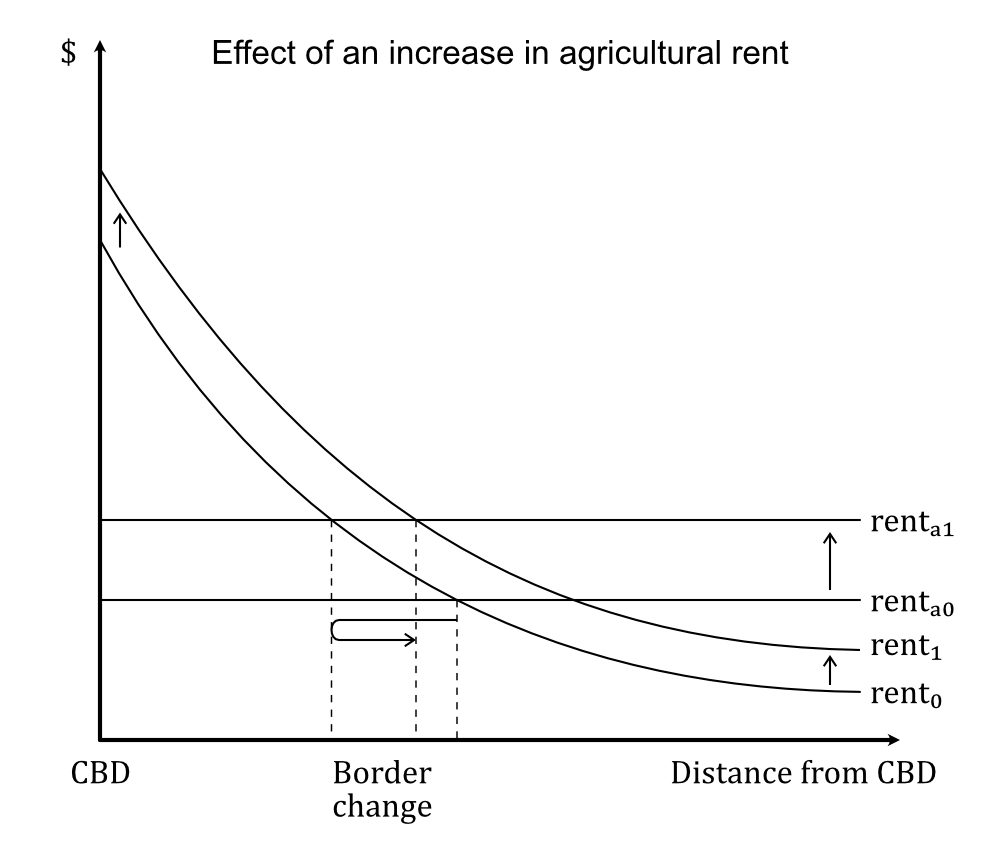

# Urban sprawl - Introduction

by [Victor Mayland Nielsen](/?p=victor-mayland-nielsen), 2022

**Part 0 - Introduction 👈** (You are here)  
[Part I - The problem](/?p=urban-sprawl-1)  
[Part II  - The solution](/?p=urban-sprawl-2)  
[Part III - ?](/?p=urban-sprawl-3) 

## Table of contents 
- [The mechanism of spatial growth](#the-mechanism-of-spatial-growth)
- [The difference between urban sprawl and spatial growth](#the-difference-between-urban-sprawl-and-spatial-growth)
- [Urban sprawl is the symptom, not the disease](#urban-sprawl-is-the-symptom-not-the-disease)

Outwards spatial growth of cities is a natural occurrence happening from population increases. Still, sometimes this expansion is exaggerated due to market failures or government failures and then we get urban sprawl. In this article, I explain when exactly spatial growth is excessive and I identify, which problems do and don't cause this excess.

## The mechanism of spatial growth
Spatial growth is a natural part of human progress. It happens for instance when:
- Populations increase
- Incomes increase

When populations increase, the total demand for square meters of living space increases. Increasing incomes has a similar effect since people want more space per person. On a city scale the accommodation for this happens upwards and outwards. 

  
Does this mean humanity will eventually doom itself by expanding on all nature and farmland?

This depends on a few questions:
1. Will populations keep rising? 
2. How does society balance urban and agricultural land?
3. How does society balance developed and natural land? 

1. According to Hans Rosling, [population growth rate will eventually reach zero](https://www.ted.com/talks/hans_rosling_global_population_growth_box_by_box?language=en). This is due to the reduced birthrate as a country develops. In developed countries the growth rate is already close to 0 and most growth comes from immigration. 
2. For this, I will cite Brueckner ([2000](https://ideas.repec.org/a/sae/inrsre/v23y2000i2p160-171.html)): "Concerns about loss of “scarce” farmland are also misplaced. Because the value of farm output is fully reflected in the amount that agricultural users are willing topay for the land, a successful bid by developers means that society values the houses and other structures built on the land more than the farm output that is forgone. If farmland became truly scarce and in need of preservation, its selling price would be high, making the land resistant to urban encroachment. With only a tiny fraction of the U.S. land area occupied by cities, farmland scarcity is not a problem currently, nor is it likely to become a problem in the future."
3. For now, this is purely a democratic process. This part is a much less developed field in economics, but there are fields of nature ressource economics, environmental economics, and climate change economics. These fields develop models to help determine the value of nature and it's worth to us. This can help us create the right balance of nature reserves and development. Since I myself believe that nature is essential to sustainable human survival in the long run, I think these models will become an essential part of international politics and spatial policy making. Solutions that can come out of this could be that the government assigns value to nature, which can help us decide where to build and keep a reasonable balance. One most also recognise that sometimes building on nature *is* the more sustainable choice, since building on another plot of land further away would lead to citizens living with less sustainable behaviour such as driving a car for more kilometers. 

Growth happens both upwards and outwards, but some factors skew towards one or the other:
- Upwards: Improvements in farming productivity
- Outwards: Improvements in transport technology
- Upwards: Improvements in construction technology
- Outwards: Increased preferences for proximity to nature and more space 
- Upwards: Increased preferences for proximity to shops, museums and other urban amenities

Jan K. Brueckner is one of the most prominent economists on the subject of urban sprawl. The relationships discussed have been shown with the monocentric city model. One of the core models of urban economics first developed by Alonso, Muth & Mills. Brueckner ([2011](https://www.jstor.org/stable/j.ctt5hhcnn)) illustrates and explains the model quite well: 

  
   
  

Monocentric city model. Figures from Brueckner ([2011](https://www.jstor.org/stable/j.ctt5hhcnn)).

The monocentric city model shows rent on the y-axis and distance from the CBD (Central Business District) on the x-axis. The curves represents the rent gradients - the rent that people pay for a unit of land at a certain distance from the CBD. The flat line is the agricultural rent. It's flat because farmers do not get benefits from being close to cities. Rent is quite correlated with urban density, since developers build more housing units when the land is more expensive. 

Since the graphs represent the equilibrium state before and after and since cities do not reach equilibrium immediately, it is helpful to read the graphs as comparing different cities.  
The first figure shows that cities with higher populations have higher rents across the board. This has both an upwards and outwards expansion effect. 
The second picture shows that cities with higher transport costs have relatively higher rent near the CBD and relatively lower rent towards the edge. The effect is higher upwards expansion and lower outwards expansion. 
The third picture shows that cities with higher agricultural rent are pressured into locating in a smaller amount of space with higher rent to accomodate the same population. The effect of that is higher upwards expansion and lower outwards expansion as well. 

This also shows that there is a slight trade-off between outwards and upwards expansion: Limits to outwards expansion creates more pressure for upwards expansion and vice versa. 

The monocentric city model is not a realistic predictive model. Its critique includes not representing real cities, assuming that everyone are the same with perfect information and relocation mobility, and putting too much emphasis on transport costs in predicting people's relocation behaviour. However, the main predictions of the model remain relevant - also empirically. Brueckner & Fansler ([1983](https://www.jstor.org/stable/1924193?seq=4#metadata_info_tab_contents)) put the three conclusions from the above pictures to the test and found significant effects on all three predictions. 

## The difference between urban sprawl and spatial growth
Both urban sprawl and spatial growth refers to outwards expansion. When it comes to urban sprawl, I prefer using Brueckner's ([2000](https://www.researchgate.net/publication/248243682_Urban_Sprawl_Diagnosis_and_Remedies)) definition, which is "*excessive* spatial growth" with emphasis on *excessive*. This definition implies that:
- Urban sprawl is undesirable
- Spatial growth/outwards expansion is not necessarily undesirable

Spatial growth from increase in population or income is by Brueckner **not** enough to classify the expansion as urban sprawl. Spatial growth from improvements in transport technology or increased preferences for proximity to nature or more space is by Bruckner ([2000](https://www.researchgate.net/publication/248243682_Urban_Sprawl_Diagnosis_and_Remedies)) **not** enough to classify expansion as urban sprawl. 

So when is spatial growth considered urban sprawl? 
It's when a market failure or government failure creates pressure towards outwards expansion, in which case urban sprawl is not the problem, it's the consequence. I explain the importance of how we define the problem in the next section. 

## Urban sprawl is the symptom, not the disease
Let's say you are born with a disease with certain symptoms. It is not deadly, but it keeps you from living your full potential. If you are lucky, there is a cure, which will end the disease without side effects. Alternatively, you can treat the symptoms using a treatment that may have side effects and might not completely resolve all the symptoms. 
Cures might sometimes involve a bigger investment, but will be more beneficial in the long run through creating less side effects. If you have gotten used to certain treatments, your body might also need time to adapt to the cure. 

Similarly, market failures inately exist everywhere in the world, they do not shut down all economies, but they keep them from reaching their potential. Some market failures have first-best policies, which solve the market failure without unintended unpredictable consequences, and some have second-best policies, which produce unintended unpredictable consequences that may need new policies and may not fully solve the market failure.
First-best policies are sometimes more costly, but in the long run they will be more beneficial because they create less consequences to develop policy for. As you develop more policies to deal with all these consequences, it becomes more difficult to switch to a better policy as society adapts to the other policies. 

However, as society grows, first-best policies become technologically more feasible. This analogy has two main implications: Firstly, it calls for a focus shift toward defining problems based on the root cause rather than the consequence. Secondly, it calls for a focus shift toward getting better at using first-best policy when possible.

Getting back to urban sprawl, by Brueckner, urban sprawl is a *consequence* of a list of market and government failures. Defining urban sprawl as the problem is like choosing to focus on the symptoms rather than the disease. Doing so creates a confusing landscape in terms of figuring out when urban sprawl is solved. 

[Go to part I - The problem](/?p=urban-sprawl-1)
