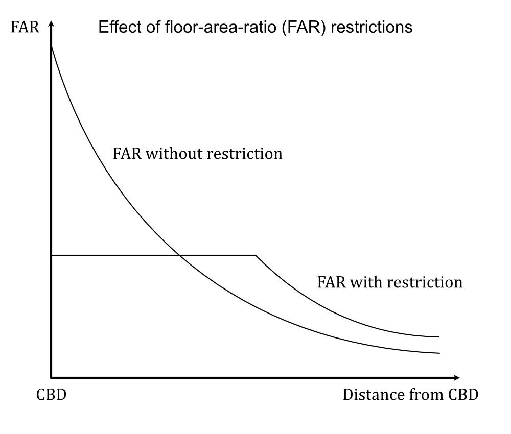

# Urban sprawl - The problem

by [Victor Mayland Nielsen](/?p=victor-mayland-nielsen), 2022

[Part 0 - Introduction](/?p=urban-sprawl-0)  
**Part I - The problem 👈** (You are here)  
[Part II  - The solution](/?p=urban-sprawl-2)  
[Part III - ?](/?p=urban-sprawl-3)  

We talked about the importance of framing the problem not as urban sprawl but as the market and government failures that separates urban sprawl from mere outwards expansion or spatial growth. Framing the problem as sprawl and ignoring the root causes of it will further complicatet he web of inefficient policies. 

## Table of contents 
- [The problems one by one](#the-problems-one-by-one)
  - [Excessive car use](#excessive-car-use) (a consequence, whose market and government failures are discussed [here](/?p=excessive-car-use-1))
  - [Land speculation](#land-speculation)
  - [Zoning and land-use regulations](#zoning-and-land-use-regulations)
  - [Historic building preservation](#historic-building-preservation)
  - [Mortgage subsidies](#mortgage-subsidies)
  - [Unbalanced infrastructure finance](#unbalanced-infrastructure-finance)
  - [Open space and nature externalities](#open-space-and-nature-externalities)
- [Other critiques of urban sprawl](#other-critiques-of-urban-sprawl)

## The problems one by one

### Excessive car use
As we saw with the [monocentric city model](/?p=urban-sprawl-0#the-mechanism-of-spatial-growth), if transport costs increase, the expected effect is more upwards pressure and less outwards pressure. In other words, a city developed with higher transport costs would develop more compactly unless the city is 100% planned. Even then, who is to say that an urban planner with full authority wouldn't take into consideration the demand of different locations in their plans?

- caption

This also means that if transport costs are lower than optimal from a transport perspective, it has the added consequence of contributing to urban sprawl. Excessive car use is a consequence transport costs that are lower than optimal, and without government intervention, transport costs are lower than optimal due to a list of market failures. The list of market failures and government failures leading to excessive car use is too long to list here, which is why this consequence gets a [whole section](/?p=excessive-driving-1) devoted to talking about the root causes of excessive car use. 

These market failures include the negative external costs of accident risks, congestion, noise and air pollution, infrastructure deterioration, climate change contribution and the costs of providing infrastructure. Government failures include commuting subsidies or solutions to the market failures that do not accurately represent the marginal cost of the externalities. 

This necessarily means that more cars and more driving does not necessarily mean that they lead to urban sprawl. If we are getting more cars and drive more kilometers in them purely because incomes are increasing or because cars are getting cheaper to buy and drive, and they get you places faster, then they do not lead to urban sprawl. In this case they just create outwards expansion that cannot be considered urban sprawl. However, no place in the world has accurately internalised the marginal external costs of driving, so while that is the case, cars do lead to urban sprawl. Also, since space is scarce and cars take space, more car driving and parking will lead to higher transport costs (transport costs include the average speed, which goes down with mor cars). 

**In other words, the many market failures and government failures that lead to excessive driving also lead to excessive spatial growth.**

Read more about removing the "excessive" from "excessive car use" [here](/?p=excessive-driving-1).

  
(Re)sources

  
Resources
  
Theoretical sources
- Effect of car use on outwards expansion
  - a
- Effect of outwards expansion on car use
  - b
Empirical sources
- Effect of car use on outwards expansion
  - Glaeser & Kahn (2004)
  - Ostermeijer et al. (2022)
- Effect of outwards expansion on car use
  - b
  

[Go to solution](/?p=urban-sprawl-2#excessive-car-use) 
### Land speculation
Land speculation is a financial activity that involves purchasing land or real estate with the hope that it will increase in value. As long as land is scarce and populations are rising, land value is expected to increase higher than inflation, which makes it a bubble very unlikely to burst. This makes land a very attractive investment increasing the demand for investing in it.

Since it is such a good investment, land speculation makes it possible to earn from simply holding on to land, whether there is a building on it or not. This gives a land owner little incentive to actually create an improvement on the land. Even if there is an improvement on the land, and it is rented out, they have little incentive to improve it further. Simply put, the possibility of land speculation in the context of urban sprawl lowers vacancy rates in housing, decreases the rate of construction, and discourages infill development. All of these add pressure to outwards expansion. 

https://www.jstor.org/stable/24773482?seq=18#metadata_info_tab_contents shows that land value taxes make density gradients steeper. 

  
(Re)sources

  
Resources
- [Neat collection of litterature reviews](https://stephenhoskins.notion.site/Lit-Review-Land-Value-Tax-969887261901432eb680185165c7f32a)
- [Excellent summary of Henry George and explanations](http://gameofrent.com)
Theoretical sources
- Effect of car use on outwards expansion
  - a
- Effect of outwards expansion on car use
  - b
Empirical sources
- Effect of car use on outwards expansion
  - Glaeser & Kahn (2004)
  - Ostermeijer et al. (2022)
- Effect of outwards expansion on car use
  - b
  

[Go to solution](/?p=urban-sprawl-2#land-speculation)
### Zoning and land use regulations
Local and national governments have many rules on what can be built where and how. These include:
- The use of the land (residential, commercial...)
- The form of the property
- Minimum parking requirements
- The internal structure of the property
- Other

  
(Re)sources

  
Resources
- 
  

[Go to solution](/?p=urban-sprawl-2#zoning-and-land-use-regulations)
#### The use of the land
Regulating the use of land is done to protect and stabilise the value of land. A factory being built next to a residential area would have consequences for the land values as well as increased external costs coming from the factory through higher exposure to air, noise, and ground pollution. Without compensation for reduced land values and without internalisation of external costs, factories or other uses with nuisance would not be disincentivised to locate in suboptimal areas and we would get suboptimal land use. On the contrary, zoning too strictly can also result in inefficient outcomes since businesses and residences will not always be in their optimal locations. Strict zoning can mean that you cannot have a shop in your house or a restaurant across the street. The effect of this specific part of zoning on urban sprawl is actually not so clear, but too much separation of zones is likely making people more car dependent since the average distance to a destination is higher the more separated uses are, and car dependency is a function of proximity.  

Brueckner 2011 and houston. 

[Go to solution](/?p=urban-sprawl-2#the-use-of-the-land)
#### The form of the property
The zoning regulations of the use of land usually also specifies the form of a building. This includes the type of building (single-family detached housing, duplexes, rowhouses etc.), height restrictions, minimum lot size restrictions, and building setbacks/frontage/garden space. All of these have the purpose to protect land values. A tall building may cast a shadow on a lot of buildings or block views (and according to [Jan Gehl](https://www.goodreads.com/book/show/8556291-cities-for-people), if out of the human scale reduce quality of the streetscape), utilities may need to be able to reach buildings, buildings with high variation in setbacks may provide an unaesthetic lack of uniformity, and small irregular lots can create issues with property rights. However, all these restrictions either increase the average dwelling size or decrease the amount of dwellings per unit of land - both of which adds pressure to outward expansion that can be considered urban sprawl. 

Brueckner ([2011](https://www.jstor.org/stable/j.ctt5hhcnn)) explains using the monocentric city model how height restrictions affect outwards expansion pressure. 

- caption

The graph shows how the floor-area-ratio restrictions create outward pressure for expansion. If the city can't build up, it must build out. 

  
(Re)sources

  
Resources
- https://cooperative-individualism.org/mills-edwin-etal_urban-sprawl-lessons-from-urban-economics-2001.pdf
  - Jan Brueckner in this article focuses on open space amenities, unbalanced finance of infrastructure, and excessive car use. He briefly mentions that another cause of excessive spatial growth is the Tiebout ([1956](http://chula.livocity.com/econ/Micro/Charit/Publicgoods/localpublicgood.pdf))
  - Edwin Mills: "The government action that most promotes excessive suburbanization is local government land use controls. Both central city and suburban governments impose draconian limits on business and residential density - prohibition of multifamily dwellings, minimum lot size requirements, heights limitations, floor-area- ratio limits, and a panoply of other controls. Such controls patently force excessive decentralization of metropolitan areas."
- https://www.sciencedirect.com/science/article/pii/S0166046204000213
Theoretical sources
- 
Empirical sources
- https://www.researchgate.net/profile/Chengri-Ding/publication/271616416_Building_height_restrictionsland_development_and_economic_costs/links/5c9edd04a6fdccd46043a1be/Building-height-restrictions-land-development-and-economic-costs.pdf
- https://www.sciencedirect.com/science/article/pii/S0166046204000213 - 

[Go to solution](/?p=urban-sprawl-2#the-form-of-the-property)
#### Minimum parking requirements
To alleviate the pressure of on-street parking demand, some cities have chosen to mandate minimum parking requirements in certain locations. This means that dependent on the assumed parking demand of the building, the government will set a minimum amount of parking spots required for development. This is often done because the buildings otherwise take advantage of the free parking provided by the street, which creates a shortage of parking spots unless they are priced. Similar to building setbacks, minimum parking requirements lower the amount of dwellings per unit of land and means less space for real estate than optimal resulting in outwards expansion pressure that we can call urban sprawl. 

  
(Re)sources

- Donald Shoup - high cost of free parking

[Go to solution](/?p=urban-sprawl-2#minimum-parking-requirements)
#### The internal structure of the property
Sometimes governments have laws regarding the internal structure of the building. Relevant to urban sprawl is regulations on the minimum room size, the minimum dwelling size, and the minimum amount of rooms per resident. Some of these are done for safety purposes, and others are done to raise the minimum standard of living. Some have complained that "greedy developers" have built too small, which have resulted in increasing the minimum dwelling size required. Unfortunately some people might have been willing to live in that space for the lower price it would have. All of these laws increase the average dwelling size and thus contributes to pressure for outwards expansion leading to more urban sprawl. 

  
(Re)sources

- Donald Shoup - high cost of free parking

[Go to solution](/?p=urban-sprawl-2#the-internal-structure-of-the-property)
#### Other
Governments also regulate the design of buildings, sets standards for quality control, and sets standards for sustainability. While these may be costly additions for developers and there might be first best solutions to some of them, they also are not expected to have important implications for urban sprawl. 

  

  
(Re)sources

- Donald Shoup - high cost of free parking

### Historic building preservation
Historic building preservation is done because old city centres have a historic amenity Koster & Rouwendal ([2017](https://academic.oup.com/ej/article-abstract/127/605/F396/5069470?login=false)). The age of the buildings are considered to be valued by the citizens. It is not exactly clear how much of this value is derived from the age of the building itself or it's historic properties and how much is from specific design choices that could be copied today, but historic areas do have value. However, preserving old buildings also functions as a height restriction since buildings cannot be rebuilt at higher densities to deal with changing demands. This limits both the average dwelling size and the amount of dwellings per land resulting in urban sprawl.

  
(Re)sources

  
Resources
- https://www.researchgate.net/profile/Chengri-Ding/publication/271616416_Building_height_restrictionsland_development_and_economic_costs/links/5c9edd04a6fdccd46043a1be/Building-height-restrictions-land-development-and-economic-costs.pdf
- https://www.sciencedirect.com/science/article/pii/S0166046204000213 
Empirical sources
- 
  

[Go to solution](/?p=urban-sprawl-2#historic-building-preservation)
### Mortgage subsidies
Mortgage subsidies are often a tool used to help people afford housing in a time of difficulty in doing so. Instead of focusing on why that doesn't work, I want to put focus on how it affects urban sprawl. Since most loans in housing are made for single-family detached housing, a housing mortgage subsidy favors purchases of single-family detached houses more than apartments. This means that a demand is induced for single-family detached housing. A type of housing taking more space. At the same time it gives homebuyers more purchasing power to buy bigger homes with larger lots resulting in taking even more space. Both of these create pressure for outwards expansion and thus result in urban sprawl. 
  
https://www.strongtowns.org/journal/2017/8/15/financing-suburbia-how-government-mortgage-policy-determined-where-youlive

  
(Re)sources

  
Resources
- https://cooperative-individualism.org/mills-edwin-etal_urban-sprawl-lessons-from-urban-economics-2001.pdf
  - "One such effect arises through the federal tax subsidy to owner-occupied housing, which arises because imputed rental income is untaxed. Harvey Rosen shows that if imputed rents were instead taxed, housing consumption for homeowners would fall by 10 to 20 percent (...) Since the resulting reduction in dwelling sizes would reduce the consumption of land, the spatial sizes of cities would ultimately fall in the absence of the housing tax subsidy."
  -
Empirical sources
- 
  

[Go to solution](/?p=urban-sprawl-2#mortgage-subsidies)
### Unbalanced infrastructure finance
We all pay taxes in the location we live in. These taxes are fairly equal across space. However the costs of the public infrastructure provided is very unequal per citizen across space. In the suburbs, the costs of providing infrastructure is a lot more costly per person than in more urban areas. This is because of economies of scale and cost sharing. This means that suburban dwellers get a big tax discount for the amount public infrastructure needed to sustain them, which induces an inefficient shift towards suburban living. Since suburban living takes more space per person, this creates an outwards expansion pressure that we can call urban sprawl. 

[Go to solution](/?p=urban-sprawl-2#unbalanced-infrastructure-finance)
### Open space and nature externalities
Nature and open space around cities provide citizens with positive amenities. People get joy out of having access to nature. Building on nature would thus cause some reductions in land values. However, being too strict on where to build can have serious impacts on housing affordability. Ignoring open space and nature externalities would lead to development patterns towards outwards expansion that we can call urban sprawl. 

[Go to solution](/?p=urban-sprawl-2#open-space-and-nature-externalities)
## Other critiques of urban sprawl
While urban sprawl is mostly a consequence of distortions (an umbrella term for government and market failures), urban sprawl also contributes to some consequences.

Brueckner & Helsley (2011) have found a connection between urban sprawl and the neglect of central city development causing inner city decay and blight. The mechanism is, that if you can develop on the fringe, there is less incentive to develop and maintain the downtown. Bradford & Kelejian (1973) has argued that the opposite is true: blight can cause urban sprawl. Brueckner (2011) argues that both likely have an element of truth.

Other critics of urban sprawl such as Burchfield et al. (2006) say that it causes scattered development leaving patches of land within the city undeveloped, which leaves wasted infrastructure and further excessive travel distances. There may be benefits of these patches in terms of leaving space for denser developments later on, but these patterns still involve some problems.

Some critics say that lower urban density areas have fewer cases of social interaction, which can cause mental and social problems, but Brueckner & Largey (2008) found that the opposite is the case. The lower the urban density, the more social interaction.

Some researchers have shown correlations between obesity and urban sprawl. However, Eid et al. (2008) find that the more likely explanation is that obese people are more likely to live in the suburbs; he found that people who move to suburbs or inner cities do not change their weight.

It is also often argued that we have to be careful not to take too much farmland away, but this argument is misguided. The value of farmland is fully reflected in the price developers pay for the land. If developers decide to buy farmland, it means that whatever use the developers have for the land is worth more than whatever use the farmers had for the land. If farmland became truly scarce and in need of preservation, its selling price would be high, making the land resistant to urban encroachment.

I have argued that urban sprawl is not only a result of artificially high transport demand (via low transport prices), but it also exacerbates the artificially high transport demand (via creating living spaces that encourage car use). The mechanism is that transport prices influence how many people use a car and how much they use them. This in turn makes people demand more car infrastructure, less infrastructure for other modes, and more low-density (sparse) housing. If the prices then are to increase, the infrastructure and the low-density developments will still exist and may never change or take decades to change. Urban sprawl thus makes transport problems very long-run problems, and the sooner it can be dealt with, the less it will burden us over time.

Regardless of the validity of these extra problems of urban sprawl, they do not pose a reason to limit spatial growth, but rather increase the urgency of solving the root causes. The root causes themselves create inefficiencies apart from just contributing to urban sprawl.

## Conclusions
Urban sprawl itself is not a problem, it's a consequence of a set of market and government failures that either produce the problem or try to combat it inefficiently. The most efficient way to solve it would be to look to the root of the problems by tackling the market failures and the policies that cause them.

I argue that the extra problems of urban sprawl pose an urgency to solve the root causes of urban sprawl rather than creating reasons to limit urban sprawl through new policies.

[Go to part II  - The solution](/?p=urban-sprawl-2)
